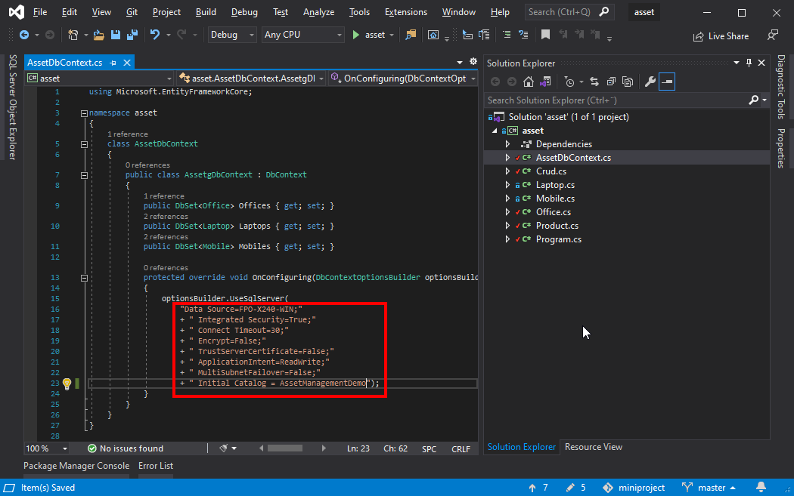
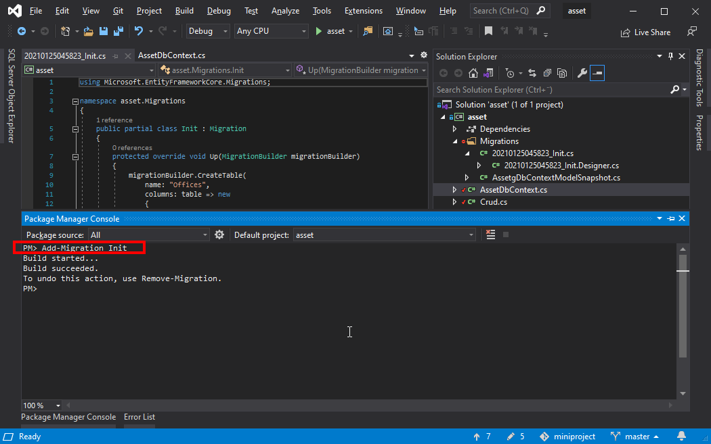
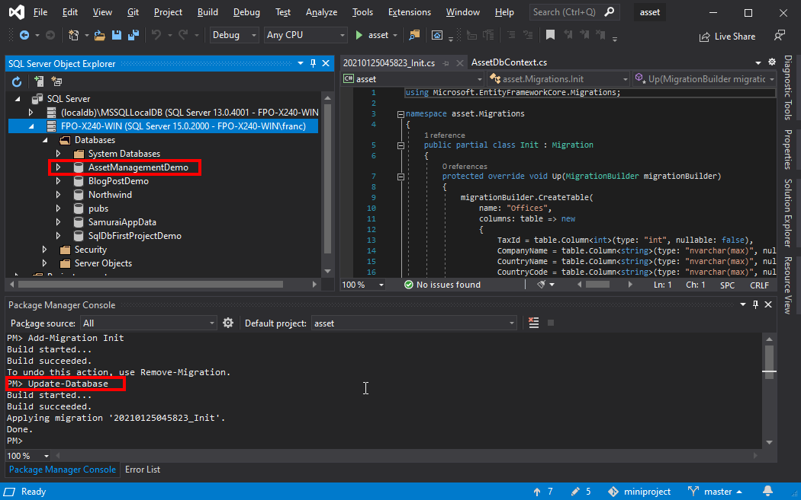
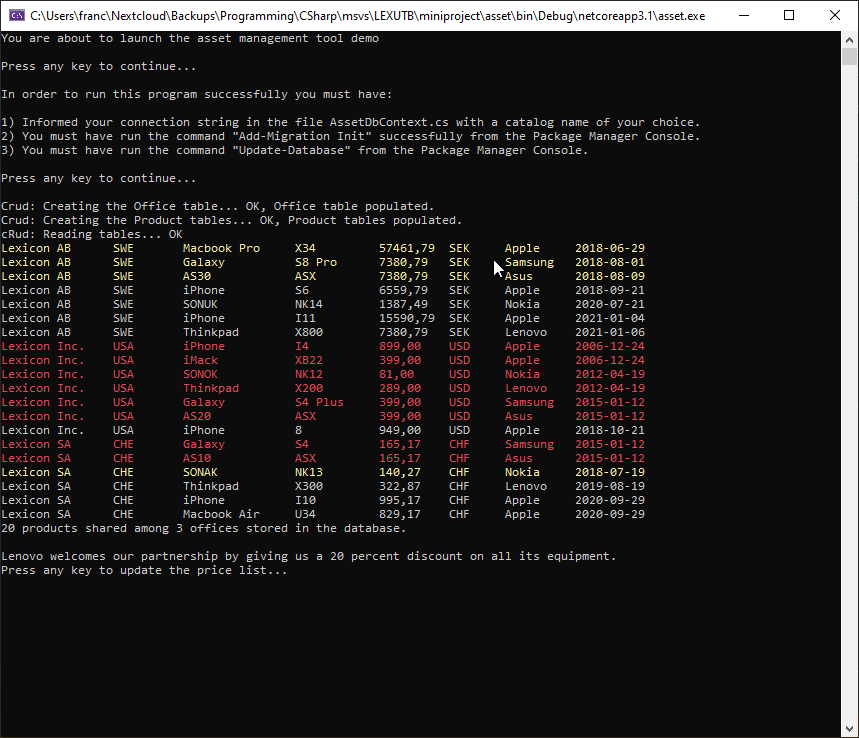

# Asset Management Tool Demo

A Console App exercise using [Entity Framework by Microsoft](https://docs.microsoft.com/en-us/aspnet/entity-framework).

## How to run this demo

In order to run this program successfully you must have:

1. Informed your connection string in the file `AssetDbContext.cs` with a catalog name of your choice.
   
2. You must have run the command `Add-Migration Init` successfully from the Package Manager Console.
   
3. You must have run the command `Update-Database` from the Package Manager Console.
   
4. In Visual Studio, press F5 to execute the program.
   